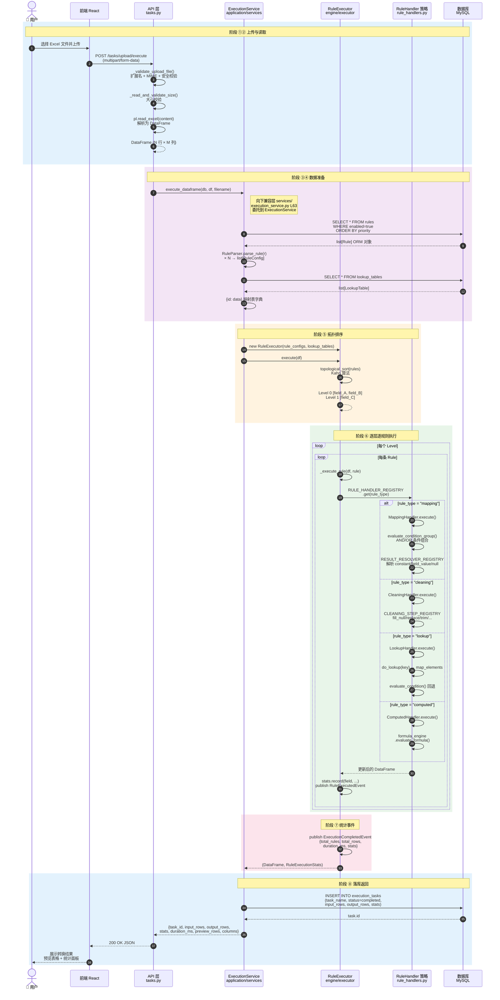
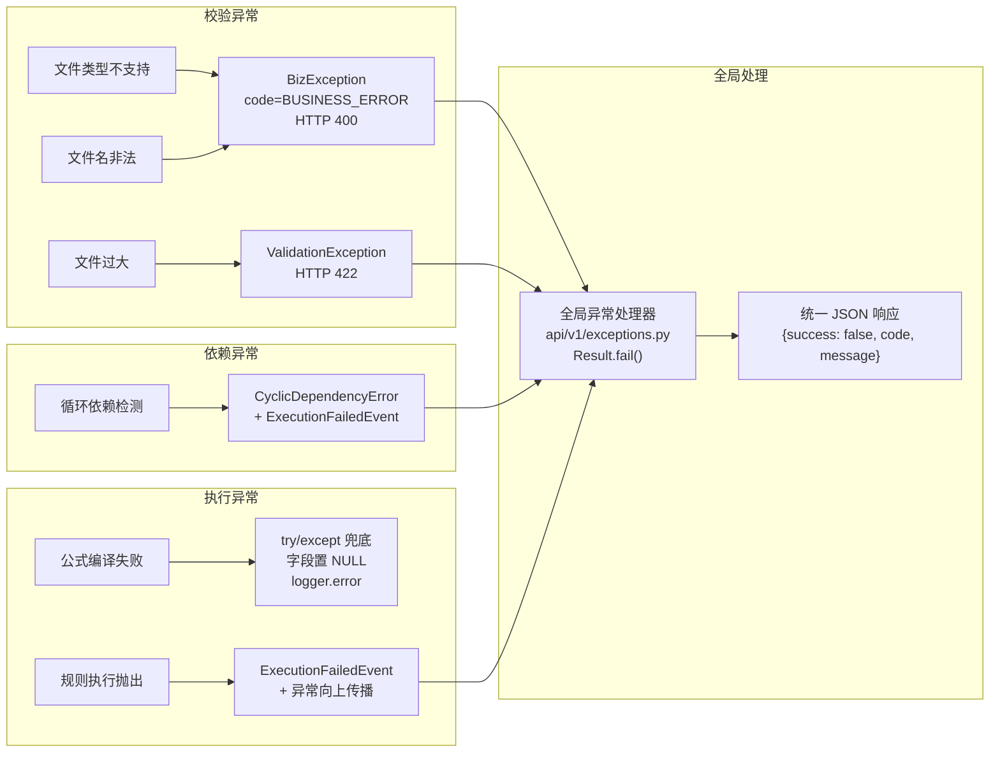

# Excel 上传到转换完成 — 数据流程图与时序图

> 本文档基于真实代码（`backend/app/`）绘制��涵盖从用户上传 Excel 到规则转换完成的完整链路。
> 所有代码路径、方法名、数据结构均与实际实现一一对应。

---

## 一、整体数据流程图

完整链路分为 **8 个阶段**：上传校验 → Polars 读取 → 加载规则 → 加载映射表 → 拓扑排序 → 策略分发执行 → 统计事件发布 → 落库返回。

```mermaid
flowchart TD
    %% ===== 阶段 1: 上传校验 =====
    subgraph P1["① 上传校验层 — tasks.py L31-70"]
        A1([👤 用户上传 Excel/CSV]) --> A2["POST /api/v1/tasks/upload/execute"]
        A2 --> A3{"扩展名白名单?<br/>_validate_upload_file"}
        A3 -- ".csv/.xlsx/.xls" --> A4{"MIME 类型校验"}
        A3 -- "其他" --> AX1(["❌ BizException<br/>BUSINESS_ERROR"])
        A4 -- "通过" --> A5{"文件名安全校验<br/>防空穿越/null字节"}
        A4 -- "不通过" --> AX1
        A5 -- "通过" --> A6["读取文件内容<br/>_read_and_validate_size"]
        A5 -- "不通过" --> AX1
        A6 --> A7{"大小 ≤ MAX_UPLOAD_SIZE_MB?"}
        A7 -- "否" --> AX2(["❌ ValidationException<br/>文件过大"])
        A7 -- "是" --> B1
    end

    %% ===== 阶段 2: Polars 解析 =====
    subgraph P2["② 数据读取层 — tasks.py L148-153"]
        B1{"文件扩展名?"}
        B1 -- ".csv" --> B2["pl.read_csv(content)"]
        B1 -- ".xlsx/.xls" --> B3["pl.read_excel(content)"]
        B2 --> B4["pl.DataFrame<br/>含原始列 + 数据"]
        B3 --> B4
    end

    %% ===== 阶段 3: 委托执行 =====
    B4 --> C1["execute_dataframe(db, df, filename)<br/>services/execution_service.py L63"]
    C1 -. "向下兼容适配" .-> C2["ExecutionService.execute_dataframe()<br/>application/services/execution_service.py L249"]

    %% ===== 阶段 4: 加载规则 + 映射表 =====
    subgraph P3["③ 数据准备层 — ExecutionService L268-277"]
        C2 --> D1["rule_repo.find_all_enabled()<br/>SELECT * FROM rules WHERE enabled=true<br/>ORDER BY priority ASC"]
        C2 --> D2["lookup_table_repo.find_all()<br/>SELECT * FROM lookup_tables"]
        D1 --> D3["RuleParser.parse_rule(r)<br/>ORM Rule → RuleConfig"]
        D2 --> D4["{str(table.id): table.data}<br/>映射表字典"]
    end

    D3 --> E1
    D4 --> E1

    %% ===== 阶段 5: 拓扑排序 =====
    subgraph P4["④ 依赖分析层 — executor.py L82 + dependency.py"]
        E1["RuleExecutor(rule_configs, lookup_tables)<br/>executor.py L59"]
        E1 --> E2["topological_sort(rules)<br/>Kahn 算法 — dependency.py L14"]
        E2 --> E3{"检测循环依赖?"}
        E3 -- "是" --> EX1(["❌ CyclicDependencyError<br/>+ ExecutionFailedEvent"])
        E3 -- "否" --> E4["分层执行队列<br/>Level 0 → Level 1 → ..."]
    end

    %% ===== 阶段 6: 策略分发执行 =====
    subgraph P5["⑤ 规则执行层 — executor.py L97-99 + rule_handlers.py"]
        E4 --> F1["for level in levels:"]
        F1 --> F2["for rule in level:"]
        F2 --> F3["_execute_rule(df, rule)<br/>executor.py L110"]
        F3 --> F4{"rule_type 查注册表<br/>RULE_HANDLER_REGISTRY"}
        F4 -- "mapping" --> FH1["MappingHandler.execute()<br/>条件映射 + 默认值回退"]
        F4 -- "cleaning" --> FH2["CleaningHandler.execute()<br/>委托 CLEANING_STEP_REGISTRY"]
        F4 -- "lookup" --> FH3["LookupHandler.execute()<br/>字典查找 + 回退条件"]
        F4 -- "computed" --> FH4["ComputedHandler.execute()<br/>formula_engine 公式计算"]
        FH1 --> F5["stats.record(field, matched, defaulted, errors)"]
        FH2 --> F5
        FH3 --> F5
        FH4 --> F5
        F5 --> F6["publish RuleExecutedEvent<br/>observer 模式"]
        F6 --> F7{"还有规则?"}
        F7 -- "是" --> F2
        F7 -- "否" --> G1
    end

    %% ===== 阶段 7: 统计 + 事件 =====
    subgraph P6["⑥ 统计与事件层 — executor.py L106 + observer.py"]
        G1["publish ExecutionCompletedEvent<br/>total_rules, total_rows, duration_ms"]
        G1 --> G2["RuleExecutionStats.to_dict()<br/>每字段 matched/defaulted/errors"]
    end

    %% ===== 阶段 8: 落库 + 返回 =====
    subgraph P7["⑦ 落库返回层 — execution_service.py L180-201"]
        G2 --> H1["ExecuteDataFrameCommand.execute()<br/>Command Pattern"]
        H1 --> H2["INSERT execution_tasks<br/>task_name, status=completed,<br/>input_rows, output_rows, stats, duration_ms"]
        H2 --> H3["构建返回字典"]
        H3 --> H4(["✅ 返回 JSON<br/>task_id, input_rows, output_rows,<br/>stats, duration_ms, preview_rows(20), columns"])
    end

    %% 样式
    classDef userInput fill:#e1f5fe,stroke:#0288d1,stroke-width:2px,color:#01579b
    classDef errorOut fill:#ffebee,stroke:#c62828,stroke-width:2px,color:#b71c1c
    classDef successOut fill:#e8f5e9,stroke:#2e7d32,stroke-width:2px,color:#1b5e20
    classDef pattern fill:#fff3e0,stroke:#ef6c00,stroke-width:1px,color:#e65100

    class A1 userInput
    class AX1,AX2,EX1 errorOut
    class H4 successOut
    class C2,F1,FH1,FH2,FH3,FH4,G1,H1 pattern
```



---

## 二、时序图 — 组件交互时序

展示 **前端 → FastAPI → ExecutionService → RuleExecutor → Handlers → DB** 的完整调用-返回时序。



---

## 三、核心组件说明

### 3.1 API 层 (`api/v1/tasks.py`)

| 端点 | 方法 | 功能 |
|------|------|------|
| `/api/v1/tasks/upload` | POST | 上传文件并预览（不做规则执行） |
| `/api/v1/tasks/upload/execute` | POST | **上传 + 执行全部规则**（本文档主链路） |

**安全校验三重防护**（`_validate_upload_file` L31-57）：
1. **扩展名白名单**：仅允许 `.csv` / `.xlsx` / `.xls`
2. **MIME 类型校验**：CSV 允许 `application/octet-stream` 宽松匹配
3. **文件名安全**：禁止 `\x00`、`/`、`\\` 防路径穿越

### 3.2 执行服务 (`application/services/execution_service.py`)

采用 **Template Method + Command Pattern** 双模式：

```
ExecutionService (Facade)
  ├── DataFrameTransformTemplate (Template Method)
  │     ├── before()  → 校验 + 计时
  │     ├── do_execute() → RuleExecutor.execute()
  │     └── after()   → 日志记录
  └── ExecuteDataFrameCommand (Command)
        ├── execute() → Template 转换 + 落库
        └── undo()    → 标记 cancelled（保留审计）
```

### 3.3 规则执行器 (`engine/executor.py`)

**纯编排层**，不含具体转换逻辑。核心方法 `execute()`：

```python
def execute(self, df: pl.DataFrame) -> tuple[pl.DataFrame, RuleExecutionStats]:
    levels = topological_sort(self.rules)    # Kahn 拓扑排序
    for level in levels:
        for rule in level:
            df = self._execute_rule(df, rule)  # 委托给注册表
    return df, self.stats
```

`_execute_rule` 是 **策略模式分发表**：

```python
def _execute_rule(self, df, rule):
    handler = RULE_HANDLER_REGISTRY.get(rule.rule_type)  # 查注册表
    df = handler.execute(df, rule, self.lookup_tables, self.stats)
    self._publish_rule_executed(rule)  # Observer 事件
    return df
```

### 3.4 四种规则处理器 (`engine/rule_handlers.py`)

| Handler | rule_type | 核心逻辑 | 委托的注册表 |
|---------|-----------|----------|-------------|
| `MappingHandler` | `mapping` | 按优先级评估条件组，命中赋值 | `RESULT_RESOLVER_REGISTRY`（constant / field_value / null） |
| `CleaningHandler` | `cleaning` | 按序执行清洗步骤 | `CLEANING_STEP_REGISTRY`（fill_null / replace / trim / regex_extract / substring） |
| `LookupHandler` | `lookup` | 按 key_field 查映射表，回退条件评估 | `operators.evaluate_condition` |
| `ComputedHandler` | `computed` | 编译并执行公式 DSL | `formula_engine.evaluate_formula` |

### 3.5 拓扑排序 (`engine/dependency.py`)

使用 **Kahn 算法**（BFS 拓扑排序），返回分层执行队列：

```
输入: [规则 A(无依赖), 规则 B(依赖A), 规则 C(依赖A,B)]
输出: [
  Level 0: [规则 A]          ← 可并行
  Level 1: [规则 B]          ← 依赖 Level 0
  Level 2: [规则 C]          ← 依赖 Level 0 + Level 1
]
```

检测到循环依赖时抛出 `CyclicDependencyError`。

### 3.6 Observer 事件系统 (`engine/observer.py`)

| 事件 | 发布时机 | 携带数据 |
|------|---------|---------|
| `RuleExecutedEvent` | 每条规则执行后 | rule_id, field_name, rule_type, matched, defaulted, errors |
| `ExecutionCompletedEvent` | 全部规则完成后 | total_rules, total_rows, duration_ms, stats |
| `ExecutionFailedEvent` | 执行异常时 | error, rule_name, rule_type |

Executor 通过 `event_bus` 参数控制：
- `None`（默认）→ 不发布事件，保持原有静默行为
- `"default"` → 使用进程级全局事件总线
- `EventBus` 实例 → 直接使用传入的总线

---

## 四、数据结构流转

### 输入：用户上传的 Excel

| city | age | name |
|------|-----|------|
| Beijing | 25 | Alice |
| Shanghai | 30 | Bob |
| Guangzhou | 35 | Carol |

### 执行中：DataFrame 逐步增强

```
Level 0:
  MappingHandler → 新增 region 列（条件命中赋值）
  city=Beijing → region="华北"
  其他 → region="其他"

Level 1:
  CleaningHandler → 清洗 name 列
  trim + replace 空值

Level 2:
  ComputedHandler → 计算 age_group
  IF(age > 30, "中年", "青年")
```

### 输出：转换后 DataFrame + 统计

| city | age | name | region | age_group |
|------|-----|------|--------|-----------|
| Beijing | 25 | Alice | 华北 | 青年 |
| Shanghai | 30 | Bob | 其他 | 青年 |
| Guangzhou | 35 | Carol | 其他 | 中年 |

**统计示例**（`stats.to_dict()`）：
```json
{
  "region": {"matched": 1, "defaulted": 2, "errors": 0},
  "name": {"matched": 3, "defaulted": 0, "errors": 0},
  "age_group": {"matched": 3, "defaulted": 0, "errors": 0}
}
```

---

## 五、设计模式落地点

| 模式 | 落地位置 | 说明 |
|------|---------|------|
| **Strategy** | `RULE_HANDLER_REGISTRY` | 4 种规则类型独立策略，新增只需注册 |
| **Strategy** | `CLEANING_STEP_REGISTRY` | 5 种清洗动作独立策略 |
| **Strategy** | `RESULT_RESOLVER_REGISTRY` | 3 种结果类型独立策略 |
| **Observer** | `EventBus` + `RuleExecutedEvent` | 规则执行事件发布-订阅 |
| **Template Method** | `DataFrameTransformTemplate` | before → do_execute → after |
| **Command** | `ExecuteDataFrameCommand` | 封装执行操作，支持 undo |
| **Factory** | `RuleParser.parse_rule()` | ORM → RuleConfig 的创建工厂 |
| **Facade** | `ExecutionService` | 屏蔽内部复杂度，提供统一入口 |
| **Adapter** | `services/execution_service.py` | 旧接口适配到新服务 |

---

## 六、异常处理路径



---

## 七、性能特征

| 指标 | 说明 |
|------|------|
| **读取性能** | Polars Rust 内核，10 万行 Excel ≈ 2-3 秒 |
| **执行性能** | 向量化操作，单规则万行级 ≈ 毫秒 |
| **并行度** | 同 Level 内规则理论上可并行（当前为串行实现） |
| **内存** | 全量加载到内存，适合中小数据集（< 100MB） |
| **事务性** | 无事务保证，单次执行全量完成或全量失败 |

---

*文档生成时间：2026-07-30 · 基于代码版本：阿里规约 + 23 种设计模式重构后*
